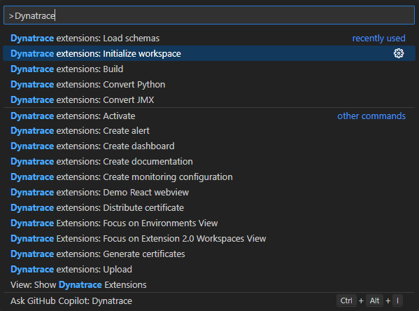
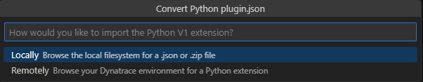

Migrating EF1 Extensions
########################

| Use this guide to understand how to migrate an existing Python EF1 extension to the new EF2 format.

Requirements
============

* `Python 3.10 <https://www.python.org/downloads/>`_
* ``dt-extensions-sdk`` installed and in your ``PATH`` (you can run with ``dt-sdk --help``).
* `VSCode <https://code.visualstudio.com>`_ with the `Dynatrace Extensions <https://marketplace.visualstudio.com/items?itemName=DynatracePlatformExtensions.dynatrace-extensions>`_ extension installed.

Step by Step
============

To migrate an existing python EF1 extension using VSCode, the steps are as follows:

1. Create a new EF2 extension
2. Import the EF1 extension using the ``Dynatrace extensions: Convert Python`` command
3. Convert the code, moving the class from the original extension to the ``__main__.py`` file of the new extension

Create a new EF2 extension
""""""""""""""""""""""""""

1. Open an empty folder in VSCode, then run the ``Dynatrace extensions: Initialize Workspace`` command
2. Select the schema version (latest recommended), and the certificates you want to use to sign the extension

|

|

3. Chose the ``Python Extension 2.0`` project type
4. Give your extension a name, it must respect the python module naming convention (all lower case with optional underscores).

|

.. image:: ../_static/img/migrate-02-type.png
  :alt: Chose project type
|

Import the Python EF1 extension
"""""""""""""""""""""""""""""""

| The first step is to convert the old ``plugin.json`` file to the new ``activationSchema.json`` format.
| This will automatically create the **Settings 2.0 UI** for your extension, which defines the UI for the user to configure the extension.
|
| Run the command ``Dynatrace extensions: Convert Python``.
| You can chose to import an existing python extension from:
|
* The extension zip file
* The plugin.json file
* From your Dynatrace environment

|

|

| In this example we are importing from a Dynatrace environment, which gives you a list of all python extensions on that environment.
|
| If you would like to import from your computer, a file picker will open, and you can select the zip or plugin.json file of your extension.

|

.. image:: ../_static/img/migrate-04-import-remote.png
  :alt: Import from dynatrace
|

| After you select an extension, your ``activationSchema.json`` will be overwritten with the correct settings.
|
| You should also review that file, to make sure your UI looks the way you want it to.
|

.. note::
   | If you are importing a local (OneAgent) extension, delete the entry **activation > remote** from the extension.yaml file.
   | If instead you are importing a remote (Activegate) extension, delete **activation > local**.
   | You can also make your extension work both remotely and locally, by keeping both entries and modifying the **activationSchema.json** file accordingly.

Modify the extension code
"""""""""""""""""""""""""

.. note::
   | We are working on automating part of this step.

| Move your existing extension code to the ``__main__.py`` file of the new extension.
| The easiest way to accomplish this is by pasting the code from your existing extension class into the new ``ExtensionImpl`` class.
|
| Here are the most important changes you need to make to your code:
|

.. list-table:: Code conversion reference
   :widths: 40 10 10 40
   :header-rows: 1

   * - Description
     - EF1 method
     - EF2 method
     - Notes
   * - Logging
     - ``self.logger.info("message")``
     - ``self.logger.info("message")``
     - Stays the same
   * - Obtaining user defined parameters
     - ``self.config.get("param_name", "default_value")``
     - ``self.activation_config.get("param_name", "default_value")``
     - You can find and replace all ``self.config.`` entries with ``self.activation_config.``
   * - Report an event
     - ``self.results_builder.report_custom_info_event``
     - ``self.report_dt_event``
     - Try to keep topology (groups, device, IDs) out of the code, this is defined later in the ``extension.yaml`` file.
   * - Report a metric
     - ``device.absolute("metric_key", metric_value, {"dimension_name": "dimension_value"})``
     - ``self.report_metric("metric_key", metric_value, {"dimension_name": "dimension_value"})``
     - There is no concept of a ``device`` in the python code anymore, send metrics directly.
   * - Create groups and custom devices
     - ``self.topology_builder.create_group``, ``group.create_device``
     - ``n/a``
     - Doesn't exist, topology is defined in the ``extension.yaml`` file.

Build and upload the extension
""""""""""""""""""""""""""""""

| Build the extension by running the command ``Dynatrace extensions: Build``.
| If the build is successful, you will see a prompt to upload the extension to your Dynatrace environment and activate it.
| Accept both prompts
|
| Navigate to your Dynatrace environment, to ``Infrastructure Observability > Extensions`` and find your extension.

|
.. image:: ../_static/img/migrate-05-activation.png
  :alt: Extension config
|

| Click ``Add monitoring configuration``
| Check that your UI looks the way you want it to, and fill in the parameters.

.. note::
   | You can copy the ``value`` from the right side JSON Snippet and use it in your ``activation.json`` file to test your extension locall with ``dt-sdk run``
|
.. image:: ../_static/img/migrate-06-activation-config.png
  :alt: Extension config
|

Limitations
"""""""""""

* The ``process snapshot`` is not yet supported, but will be added in the future. As a workaround the file ``<dynatrace_log_path>/dynatrace/oneagent/plugin/oneagent_latest_snapshot.log`` can be read and parsed as JSON.
* The metric metadata and topology must be added to the ``extension.yaml`` file, part of this will be automated in the future.

